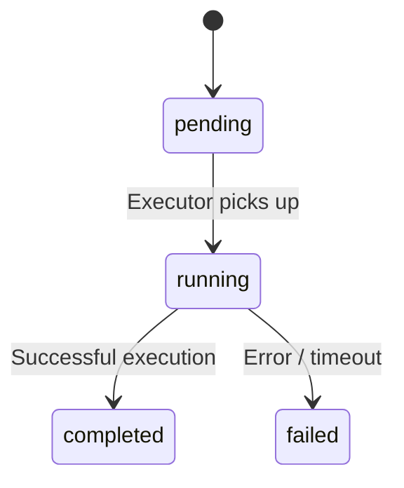

# Submissions API

Endpoints for managing algorithm submissions and viewing the leaderboard. All endpoints are prefixed with `/api/submissions`.

## Submit Algorithm

Submit a new trading algorithm for execution.

```
POST /api/submissions
```

**Headers:** `Authorization: Bearer <token>`

**Request Body:**

```json
{
  "code": "def run():\n    buy('OIL', 100)\n\nrun()",
  "language": "python"
}
```

| Field | Type | Required | Values |
|-------|------|----------|--------|
| `code` | string | Yes | Algorithm source code |
| `language` | enum | Yes | `python` or `cpp` |

**Response** `201 Created`:

```json
{
  "id": "clx...",
  "status": "pending",
  "language": "python",
  "createdAt": "2025-06-15T14:30:00.000Z"
}
```

## Status Lifecycle



---

## List Submissions

Get the authenticated user's submissions.

```
GET /api/submissions
```

**Headers:** `Authorization: Bearer <token>`

**Query Parameters:**

| Param | Type | Default | Description |
|-------|------|---------|-------------|
| `limit` | number | 20 | Max results |
| `offset` | number | 0 | Pagination offset |

**Response** `200 OK`:

```json
[
  {
    "id": "clx...",
    "language": "python",
    "status": "completed",
    "netWorth": 105432.50,
    "executionTimeMs": 12340,
    "createdAt": "2025-06-15T14:30:00.000Z"
  }
]
```

!!! note
    The `code` field is excluded from list responses for performance.

---

## Get Submission

Get a specific submission (owner only).

```
GET /api/submissions/:id
```

**Headers:** `Authorization: Bearer <token>`

**Response** `200 OK`:

```json
{
  "id": "clx...",
  "code": "def run():\n    ...",
  "language": "python",
  "status": "completed",
  "netWorth": 105432.50,
  "executionTimeMs": 12340,
  "error": null,
  "createdAt": "2025-06-15T14:30:00.000Z"
}
```

---

## Leaderboard

Get the top submissions ranked by net worth. **No authentication required.**

```
GET /api/submissions/leaderboard
```

**Query Parameters:**

| Param | Type | Default | Description |
|-------|------|---------|-------------|
| `limit` | number | 10 | Max results |

**Response** `200 OK`:

```json
[
  {
    "id": "clx...",
    "netWorth": 125000.00,
    "language": "python",
    "executionTimeMs": 8500,
    "user": {
      "displayName": "TraderJoe"
    }
  }
]
```

---

## My Best Submission

Get the authenticated user's highest-scoring submission.

```
GET /api/submissions/me/best
```

**Headers:** `Authorization: Bearer <token>`

**Response** `200 OK`:

```json
{
  "submission": {
    "id": "clx...",
    "netWorth": 105432.50,
    "language": "python"
  },
  "rank": 3
}
```

Returns `submission: null` if the user has no completed submissions.
