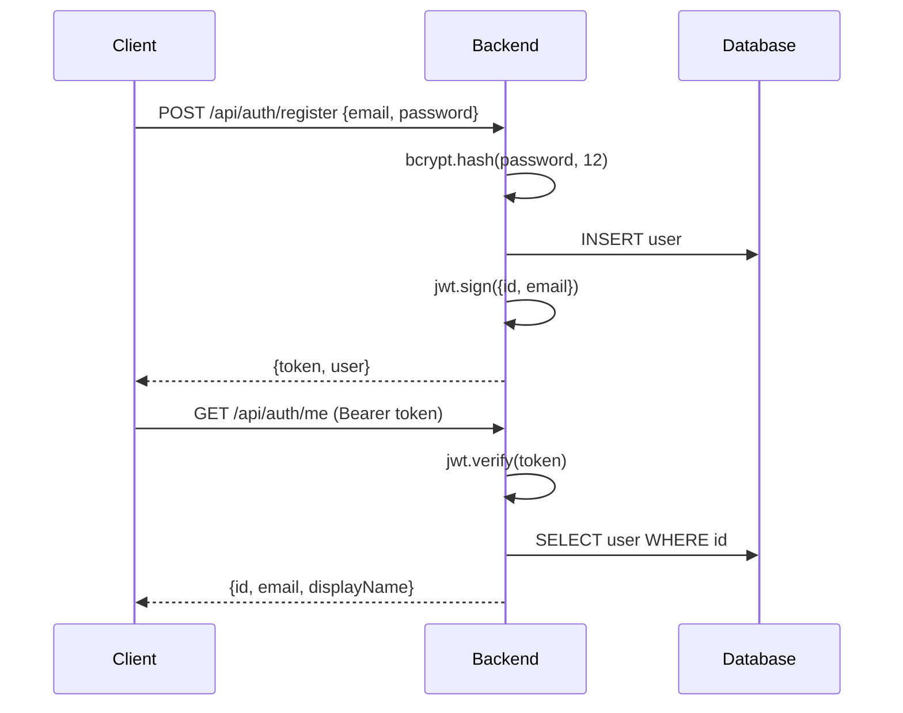

# Backend Architecture

The backend is a Node.js application built with [Fastify](https://fastify.dev/) and follows a modular architecture.

## Tech Stack

| Component | Technology |
|-----------|-----------|
| Runtime | Node.js 22 (ESM) |
| Framework | Fastify 4 |
| Database | PostgreSQL via Prisma ORM |
| Cache | Redis via ioredis |
| Auth | JWT (@fastify/jwt) + bcrypt |
| HTTP Client | axios |

## Module System

Each feature is a self-contained module in `src/modules/`:

```
src/modules/
├── auth/           # User registration, login, JWT, profile
│   ├── routes.js
│   ├── schemas.js
│   └── auth.test.js
├── market/         # Market sim proxy (status, orderbook, candles)
│   ├── routes.js
│   └── market.test.js
├── news/           # News feed proxy
│   ├── routes.js
│   └── news.test.js
└── submissions/    # Algorithm submissions, leaderboard
    ├── routes.js
    ├── schemas.js
    ├── routes.test.js
    └── submissions.test.js
```

## Plugin System

Fastify plugins in `src/plugins/` provide shared infrastructure:

- **prisma.js** — Database client, available as `fastify.prisma`
- **redis.js** — Redis client, available as `fastify.redis`

## Authentication Flow



## Error Handling

All errors follow a consistent format:

```json
{
  "error": "Human-readable error message",
  "statusCode": 400
}
```

- 4xx errors return the actual error message
- 5xx errors return `"Internal server error"` (real message logged server-side)

## Rate Limiting

Global rate limit via `@fastify/rate-limit`:

- **100 requests per minute** per IP
- Configurable via environment variables

## Database Schema

Key models (Prisma):

- **User** — id, email, passwordHash, displayName, createdAt
- **Submission** — id, userId, code, language (python/cpp), status, netWorth, error, executionTimeMs
- **Candle** — symbol, interval, timestamp, open, high, low, close, volume

See `backend/prisma/schema.prisma` for the full schema.
