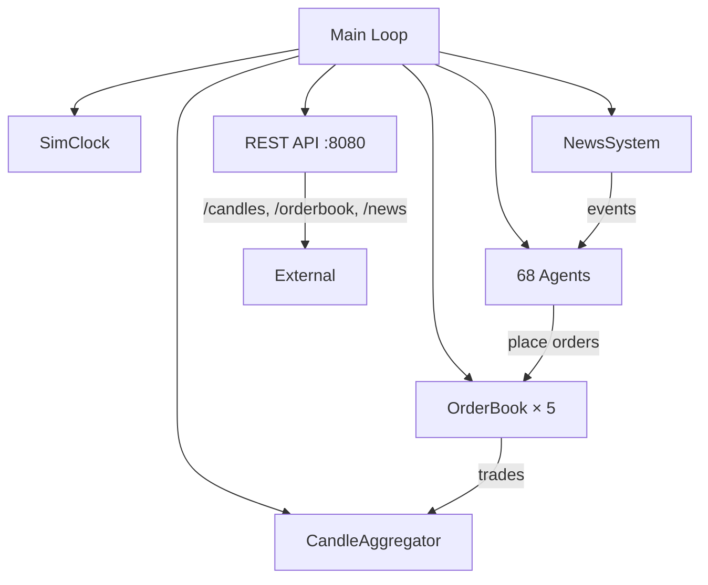

# Market Simulation Engine

The market simulation is a C++17 application that runs a realistic commodity exchange with an order-book matching engine and AI trading agents.

## Architecture



## Tick Cycle

Each tick follows an 11-step sequence:

1. **Advance clock** — SimClock increments tick counter
2. **Generate news** — Poisson-distributed events
3. **Agents decide** — Each agent evaluates and places orders
4. **Match orders** — Order book matches with price-time priority
5. **Execute trades** — Update agent positions and balances
6. **Aggregate candles** — OHLCV data across 6 intervals
7. **Check circuit breakers** — Halt trading if price moves >10%
8. **Update statistics** — Rolling metrics for agents
9. **Log state** — Periodic logging
10. **Export data** — Write to disk if configured
11. **Serve API** — Handle incoming REST requests

## Order Book

Each commodity has its own limit order book with:

- **Price-time priority** matching
- **Bid/ask spread** tracking
- **Depth** — full book available via API
- Market orders execute immediately against resting limit orders

## Commodities

| Symbol | Category | Base Price | Description |
|--------|----------|-----------|-------------|
| OIL | Energy | $75 | Crude oil |
| STEEL | Construction | $120 | Steel |
| WOOD | Construction | $45 | Lumber |
| BRICK | Construction | $25 | Brick |
| GRAIN | Agriculture | $8 | Grain |

Cross-commodity effects model supply chain relationships (e.g., energy prices affect construction costs).

## Agent Types

| Agent | Count | Strategy |
|-------|-------|----------|
| SupplyDemand | 10 | Tracks fundamental supply/demand balance |
| Momentum | 10 | Follows price trends |
| MeanReversion | 10 | Bets on price returning to mean |
| Noise | 15 | Random trading (provides liquidity) |
| MarketMaker | 8 | Quotes both sides of the book |
| CrossEffects | 5 | Trades based on inter-commodity correlations |
| Inventory | 5 | Manages portfolio balance |
| Event | 5 | Reacts to news events |

**Total: 68 agents** generating realistic market microstructure.

## News System

News events are generated with Poisson distribution:

- **Categories**: Supply, Demand, Geopolitical, Weather
- **Sentiment**: positive, negative, neutral
- **Magnitude**: 0.0 – 1.0 (impact severity)
- Agents react to news based on their type and the affected commodity

## Time Scaling

- **Ticks per day**: configurable (default 1440)
- **Sim time**: maps ticks to calendar dates
- **Reference ticks/day**: 1440 (1 per minute) for scale calculations

## REST API

The market sim exposes these endpoints on port 8080:

| Method | Endpoint | Description |
|--------|----------|-------------|
| GET | `/health` | Health check |
| GET | `/state` | Current sim state |
| GET | `/commodities` | All commodities with prices |
| GET | `/orderbook/:symbol` | Full order book |
| GET | `/candles/:symbol` | OHLCV data with interval/limit/since params |
| GET | `/news` | News events with tick/limit filters |
| POST | `/control` | Start/stop/reset simulation |
| GET | `/config` | Current configuration |
| PUT | `/config` | Update configuration |
| GET | `/stream` | SSE event stream |

## Building

```bash
cd market_sim
mkdir build && cd build
cmake -DCMAKE_BUILD_TYPE=Release ..
cmake --build . --config Release
```

The binary is `build/Release/market_sim` (or `market_sim.exe` on Windows).
