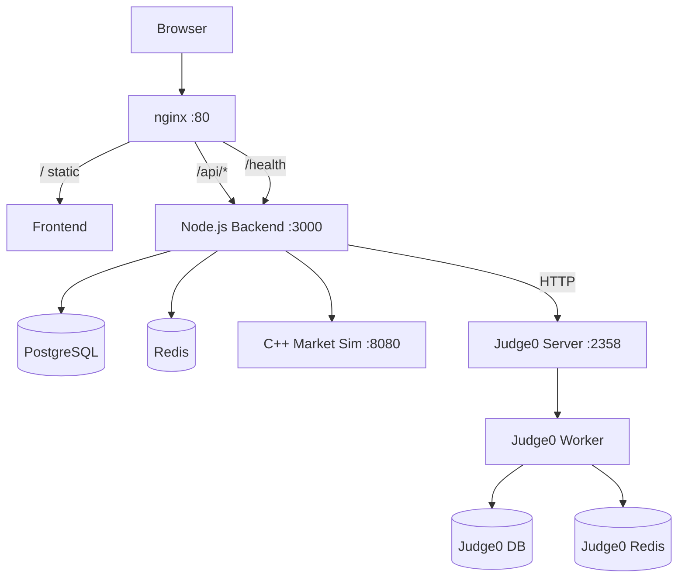
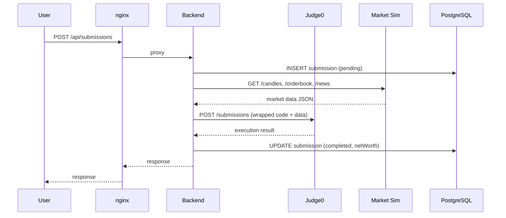

# Architecture Overview

Decrypt is a multi-service platform orchestrated via Docker Compose with nginx as the reverse proxy.

## System Diagram

## Request Flow

### Page Load
1. Browser requests `http://localhost/`
2. nginx serves `frontend/index.html` and static assets
3. Alpine.js SPA initializes, loads page templates via `templateLoader.js`
4. API calls go to `/api/*` → proxied to Node.js backend on `:3000`

### Algorithm Submission
1. User submits code via `POST /api/submissions`
2. Backend stores submission in PostgreSQL (status: `pending`)
3. Executor service generates a wrapper (Python/C++) with injected market data
4. Wrapper sent to Judge0 for sandboxed execution
5. Judge0 returns stdout with JSON results
6. Backend parses results, updates submission with net worth
7. Leaderboard recalculated

### Market Data
1. Backend proxies `GET /api/market/*` to C++ market sim on `:8080`
2. Market sim runs continuously with 68 AI agents trading
3. Candle data, orderbooks, and news are served via REST API
4. Data is also synced to PostgreSQL for historical access

## Services

| Service | Port | Role |
|---------|------|------|
| **nginx** | 80 | Reverse proxy, static file server |
| **Node.js Backend** | 3000 (internal) | REST API, business logic |
| **C++ Market Sim** | 8080 | Order book engine, price generation |
| **Redis** | 6379 (internal) | Caching, rate limiting |
| **PostgreSQL** | 5432 (internal) | User data, submissions, market history |
| **Judge0** | 2358 | Sandboxed code execution |

## Data Flow

