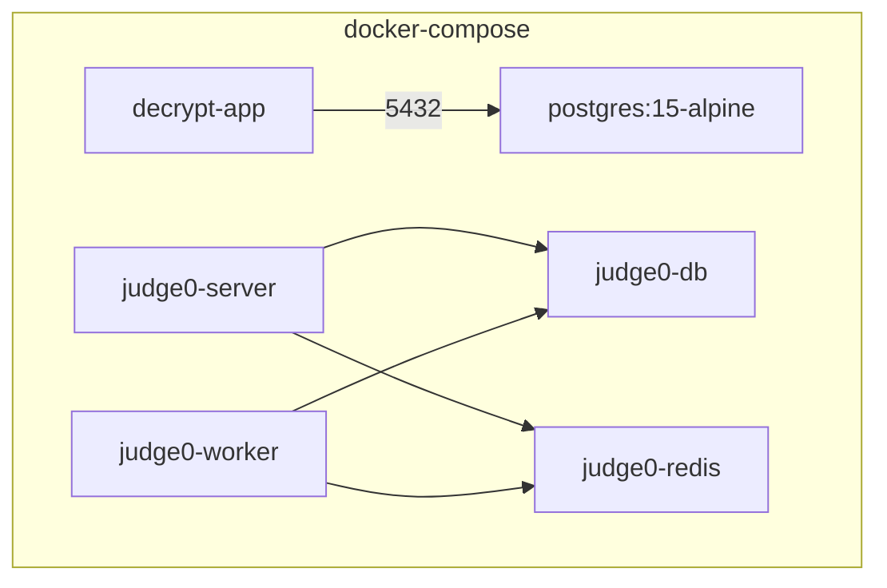

# Docker Deployment

Decrypt uses a multi-container Docker setup orchestrated with Docker Compose.

## Architecture



## Quick Deploy

```bash
cd docker
docker-compose up -d
```

Wait ~2 minutes for all services to initialize (market sim populates 1M ticks on first start).

## Container Details

### decrypt-app (Multi-service)

Built from `Dockerfile.single` — a multi-stage build that compiles the C++ market sim, installs Node.js dependencies, and bundles everything into a single Alpine container running:

| Process | Manager | Description |
|---------|---------|-------------|
| market_sim | supervisord | C++ simulation engine on :8080 |
| backend | supervisord | Node.js API on :3000 |
| nginx | supervisord | Reverse proxy on :80 |
| redis | entrypoint | Cache on :6379 |

### Judge0

Two containers:

- **judge0-server** — API on :2358, receives code submissions
- **judge0-worker** — Processes submissions in isolated sandboxes

Both require privileged mode for container-in-container execution.

## Volumes

| Volume | Purpose |
|--------|---------|
| `postgres_data` | App database persistence |
| `decrypt_data` | Market data exports (/data) |
| `judge0_postgres_data` | Judge0 database |

## Ports

| Port | Service | Description |
|------|---------|-------------|
| 80 | nginx | Frontend + API |
| 8080 | market_sim | Market sim API (direct access) |
| 2358 | judge0-server | Code execution API |

## Build Process

The `Dockerfile.single` uses a 3-stage build:

1. **cpp-builder** (Alpine + CMake) — Compiles market_sim binary
2. **node-builder** (Node 22) — Installs npm deps, generates Prisma client
3. **runtime** (Alpine) — Combines everything with nginx, Redis, supervisord

```bash
# Rebuild after changes
cd docker
docker-compose build --no-cache decrypt
docker-compose up -d
```

## Logs

```bash
# All services
docker logs decrypt-app

# Specific process logs (inside container)
docker exec decrypt-app cat /var/log/supervisor/backend.log
docker exec decrypt-app cat /var/log/supervisor/market_sim.log
docker exec decrypt-app cat /var/log/supervisor/nginx.log
```

## Health Checks

```bash
# App container
curl http://localhost/health

# Market sim
curl http://localhost:8080/health

# Judge0
curl http://localhost:2358/about

# Database
docker exec decrypt-postgres pg_isready -U decrypt
```
