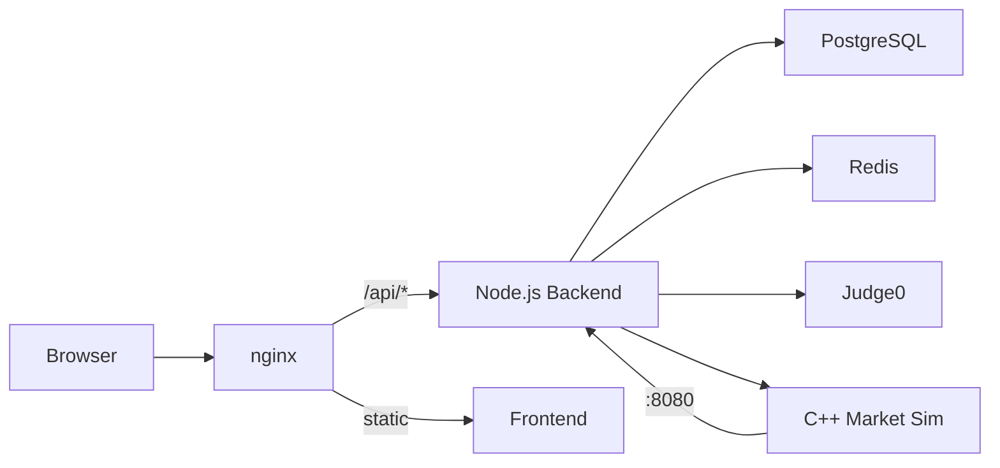

# Decrypt - Algorithmic Trading Competition Platform

Welcome to the Decrypt documentation. Decrypt is a full-featured algorithmic trading competition platform where users write Python or C++ strategies that trade against a realistic commodity market simulation.

## What is Decrypt?

Decrypt provides:

- **Realistic Market Simulation** — A C++ order-book engine with 68 AI agents generating natural price action across 5 commodities
- **Sandboxed Code Execution** — User algorithms run safely via Judge0 sandbox
- **Competitive Leaderboard** — Rank by final net worth after 1M ticks of trading
- **Rich Market Data** — OHLCV ticks, order books, and news events
- **Professional UI** — TradingView charts, real-time market status, Alpine.js SPA

## Quick Links

| Section | Description |
|---------|-------------|
| [Quick Start](getting-started/quickstart.md) | Get running in 5 minutes |
| [Architecture](architecture/overview.md) | System design and components |
| [API Reference](api/auth.md) | REST API documentation |
| [Algorithm Guide](algorithms/guide.md) | Write your first trading strategy |
| [Deployment](deployment/docker.md) | Docker deployment guide |

## Tech Stack

| Component | Technology |
|-----------|-----------|
| **Backend** | Node.js, Fastify, Prisma, PostgreSQL, Redis |
| **Market Sim** | C++17, order-book engine, cpp-httplib |
| **Frontend** | Vanilla JS, Alpine.js, TradingView Charts |
| **Code Execution** | Judge0 sandbox |
| **Infrastructure** | Docker, nginx, supervisord |

## Architecture at a Glance

