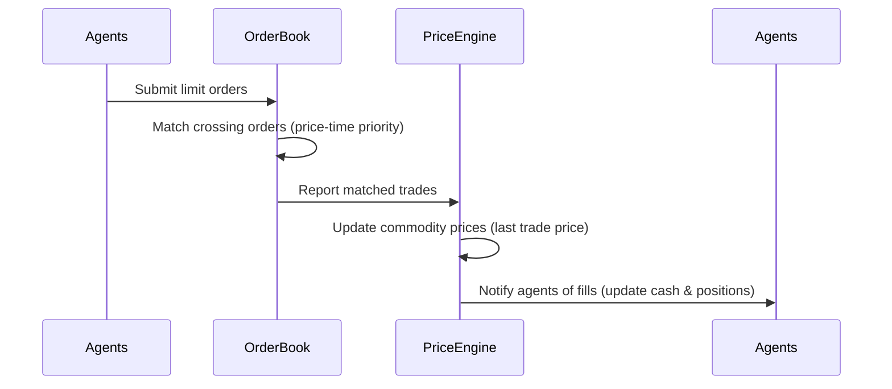

# Order Book & Matching Engine

The core of the market simulation is a **continuous double-auction limit order book** for each commodity. This is the same mechanism used by real exchanges like the NYSE and CME.

## How the Order Book Works

Each of the 5 commodities has its own independent order book. The book maintains two sorted queues:

- **Bids** (buy orders) — sorted highest price first
- **Asks** (sell orders) — sorted lowest price first

```
         ASKS (sell side)
    ┌──────────────────────┐
    │  $76.20  ×  15 units │  ← lowest ask (best offer)
    │  $76.50  ×   8 units │
    │  $76.80  ×  22 units │
    │  $77.00  ×  12 units │
    └──────────────────────┘
         ─── SPREAD ───
    ┌──────────────────────┐
    │  $75.80  ×  20 units │  ← highest bid (best bid)
    │  $75.50  ×  10 units │
    │  $75.20  ×  30 units │
    │  $75.00  ×   5 units │
    └──────────────────────┘
         BIDS (buy side)
```

The **spread** is the gap between the best bid and the best ask. In the example above, the spread is $76.20 - $75.80 = $0.40.

## Matching Algorithm

Orders are matched using **price-time priority**:

1. A new buy order checks the ask side: if the order's price ≥ the best ask, a trade executes
2. A new sell order checks the bid side: if the order's price ≤ the best bid, a trade executes
3. Trades execute at the **resting order's price** (the order that was already in the book)
4. If multiple orders are at the same price, the **oldest** order fills first

### Match Cycle

Every tick, after all agents have submitted their orders:



## Trade Execution

When a trade matches:

1. **Buyer** pays `trade.price × trade.quantity` → cash decreases, position increases
2. **Seller** receives `trade.price × trade.quantity` → cash increases, position decreases
3. The commodity's **last price** updates to the trade price
4. Trade is recorded with buyer/seller IDs and agent types for analytics
5. Both agents are notified so they can update their internal state

## Price Discovery

Prices in the simulation emerge organically from the order flow:

- There is **no formula** that sets prices — they are purely the result of supply and demand expressed through orders
- The last traded price becomes the commodity's current price
- Market makers keep the spread tight, so prices update frequently
- Fundamental agents anchor prices near supply/demand equilibrium
- Momentum and noise agents create short-term volatility

## Order Types

All orders in the simulation are **limit orders** — they specify a maximum buy price or minimum sell price. Market orders are simulated by placing limit orders at aggressive prices (well above the best ask for buys, well below the best bid for sells).

Each order contains:

| Field | Description |
|-------|-------------|
| `symbol` | Which commodity (e.g., "OIL") |
| `side` | Buy or Sell |
| `price` | Limit price |
| `quantity` | Number of units |
| `agentId` | Which agent placed it |
| `timestamp` | When it was placed |

## Order Flow Per Tick

On a typical tick during live trading:

- **~10-15 agents** place orders (not all agents trade every tick)
- **~3-5 trades** match (many orders rest in the book)
- **5 order books** process independently and in parallel
- Each matched trade triggers price and position updates

## Metrics Tracked

The engine continuously tracks:

| Metric | Description |
|--------|-------------|
| `totalTicks` | How many ticks have elapsed |
| `totalTrades` | Cumulative number of matched trades |
| `totalOrders` | Cumulative number of orders submitted |
| `avgSpread` | Average bid-ask spread across all commodities |
| Agent type stats | Per-type fill counts, volume traded, cash flows |

## Candle Aggregation

The `CandleAggregator` converts the raw tick-by-tick price stream into standard OHLCV (Open, High, Low, Close, Volume) candles at six simultaneous intervals:

| Interval | Candles per Day (live) | Use Case |
|----------|----------------------|----------|
| 1 minute | 1,200 | Short-term scalping analysis |
| 5 minutes | 240 | Intraday patterns |
| 15 minutes | 80 | Swing trading |
| 30 minutes | 40 | Position sizing |
| 1 hour | 20 | Daily strategy |
| 1 day | 1 | Long-term trends |

Each candle records the first price (open), highest price (high), lowest price (low), last price (close), and total volume during the interval.
