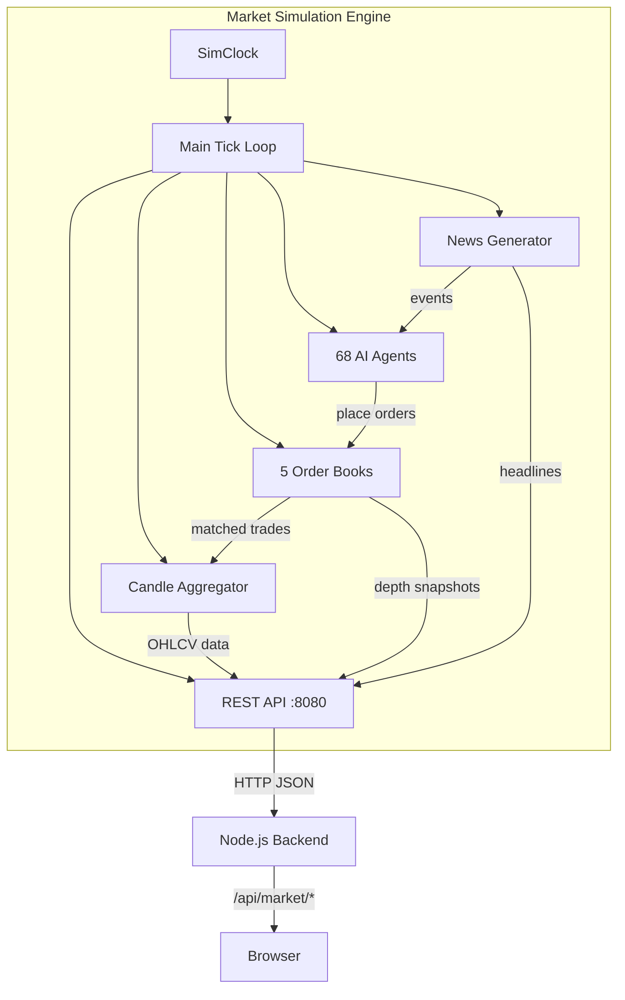
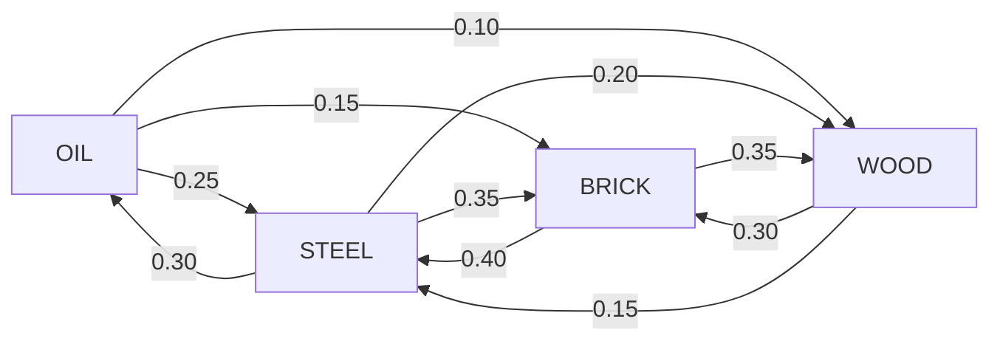

# How the Market Simulation Works

The market simulation is a **C++17 real-time commodity exchange** that generates realistic price data through an order-book matching engine and a population of autonomous AI trading agents. It powers all the market data in Decrypt — prices, candles, orderbooks, and news events that algorithms trade against.

## High-Level Architecture

## The Tick Cycle

The simulation advances in discrete **ticks**. Each tick represents a fraction of a simulated trading day. On every tick, the engine executes the following steps in order:

| Step | What Happens |
|------|-------------|
| 1. Clock advance | `SimClock` increments the tick counter and updates the simulated timestamp |
| 2. Day boundary | If a new day starts: circuit breakers reset, daily volumes clear, day-open prices are marked |
| 3. News generation | The `NewsGenerator` produces events via a Poisson process |
| 4. News processing | Events apply supply/demand shocks to commodities and update agent beliefs |
| 5. Sentiment decay | Agent and global sentiments decay toward zero (mean-reverting) |
| 6. Supply/demand update | Each commodity's fundamental supply/demand balance evolves |
| 7. Agent decisions | All 68 agents evaluate the current `MarketState` and submit orders |
| 8. Order matching | Each order book runs price-time priority matching |
| 9. Trade execution | Matched trades update agent positions, cash, and commodity prices |
| 10. Candle aggregation | Prices are recorded into OHLCV candles across 6 intervals (1m, 5m, 15m, 30m, 1h, 1d) |
| 11. Logging | Periodic metrics logged every 1,000 ticks |

## Time Scaling

The simulation maps ticks to calendar dates via `SimClock`:

| Mode | Ticks per Day | Purpose |
|------|---------------|---------|
| **Populate (coarse)** | 576 | Fast historical data generation — covers most of the populate period |
| **Populate (fine)** | 1,440 | Higher-resolution data for the final 7 days of populate |
| **Live trading** | 72,000 | Real-time operation (~50ms per tick) |

The `tickScale` factor normalizes agent behavior so that the same agent logic works correctly regardless of the tick rate. For example, sentiment decays proportionally to `tickScale`, not raw tick count.

## Two-Phase Population

When the simulation starts, it first **populates** historical data before entering live mode:

1. **Phase 1 — Coarse populate**: Runs N days at 576 ticks/day. This is fast (~10 seconds per 100 days) and establishes the price history.
2. **Phase 2 — Fine populate**: Runs the final 7 days at 1,440 ticks/day. This creates higher-resolution recent data so the live orderbook and candles look natural from day one.

After population completes, the engine switches to 72,000 ticks/day and begins live trading at 50ms per tick.

## Commodities

Five commodities are traded, each with distinct base prices, volatilities, and supply/demand dynamics:

| Symbol | Name | Category | Base Price | Volatility | Production | Consumption |
|--------|------|----------|-----------|-----------|------------|-------------|
| **OIL** | Crude Oil | Energy | $75.00 | 3.0% | 100 | 100 |
| **STEEL** | Steel | Construction | $120.00 | 2.5% | 80 | 80 |
| **WOOD** | Lumber | Construction | $45.00 | 3.5% | 120 | 120 |
| **BRICK** | Brick | Construction | $25.00 | 2.0% | 150 | 150 |
| **GRAIN** | Grain | Agriculture | $8.00 | 4.0% | 200 | 200 |

### Cross-Commodity Effects

Commodities are linked through a supply-chain correlation matrix. When one commodity's price moves, it exerts partial pressure on related commodities:

For example, a 10% rise in OIL creates upward pressure of 2.5% on STEEL, 1.5% on BRICK, and 1.0% on WOOD — modeling how energy costs ripple through construction materials.

## News System

News events drive short-term volatility and sentiment shifts. They are generated by a Poisson process with rate lambda (configurable, default 0.05 events per tick).

### News Categories

| Category | Effect | Impact |
|----------|--------|--------|
| **Supply** | Applies a supply shock to a specific commodity (e.g., "Oil pipeline disruption") | Positive news → price decrease (more supply), negative → price increase |
| **Demand** | Applies a demand shock (e.g., "Construction boom expected") | Positive news → price increase, negative → decrease |
| **Global** | Shifts global market sentiment affecting all commodities | ±30% of magnitude added to global sentiment |
| **Political** | Similar to global but models regulatory/policy changes | ±30% of magnitude added to global sentiment |

Each news event has:

- **`symbol`** — which commodity is affected (for Supply/Demand events)
- **`sentiment`** — positive, negative, or neutral
- **`magnitude`** — 0.0 to 1.0, how severe the event is
- **`headline`** — human-readable description

Agents receive all news events and update their internal beliefs accordingly. Different agent types react differently — Event agents react strongly, while Noise traders are mostly unaffected.

## Circuit Breakers

Each commodity has a circuit breaker that halts trading if the price moves more than 10% from the day's opening price. Circuit breakers reset at the start of each new trading day.

## Data Export

The engine continuously records tick data into an in-memory ring buffer (1M ticks). It also aggregates OHLCV candles at six intervals simultaneously. On startup with the `--export-on-start` flag, it writes the full dataset to disk for the backtest executor to use.
